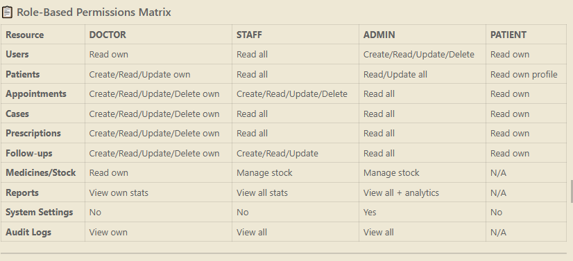

## DOCTOR
✅ ALLOWED:
  - Manage own patients
  - Create/schedule own appointments
  - Create prescriptions for their patients
  - Create/manage cases for their patients
  - Create follow-ups for their patients
  - View own medicine stock
  - View own statistics & revenue
  
❌ BLOCKED:
  - Access other doctors' data
  - Manage users or staff
  - Delete appointments (only reschedule/cancel)
  - Change system settings
  - Create other doctors

## STAFF

✅ ALLOWED:
  - View all patients
  - Create/manage appointments for any doctor
  - View all prescriptions
  - View all cases
  - Manage follow-ups
  - Manage medicine stock & inventory
  - View clinic-wide reports & statistics
  - Export data/reports
  
❌ BLOCKED:
  - Create medical diagnoses/prescriptions (doctor-only)
  - Delete sensitive records
  - Manage users or doctors
  - Change system settings
  - Access financial/billing data (if restricted)

## ADMIN

✅ ALLOWED:
  - Full system access
  - Create/Update/Delete all users
  - Assign roles to staff/doctors
  - Manage all patients, appointments, cases
  - View all reports & analytics
  - Configure system settings
  - Manage medicine inventory
  - View audit logs
  - Backup/export data
  
❌ BLOCKED:
  - Cannot be restricted by design (full access)

## PATIENT
✅ ALLOWED:
  - View own profile
  - View own appointments (upcoming & past)
  - View own medical records & cases
  - View own prescriptions
  - View follow-up recommendations
  - Request appointment
  - Update own contact info
  
❌ BLOCKED:
  - View other patients' data
  - Modify medical records
  - Create prescriptions
  - Access billing data
  - Delete accounts